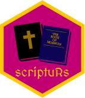

# scriptuRs 

[](https://cran.r-project.org/package=scriptuRs)
[](https://zenodo.org/badge/latestdoi/163114579)

## An R Package for the Complete LDS Scriptures

This package provides access to the full text of the Standard Works for The Church of Jesus Christ of Latter-day Saints: the Old and New Testaments, the Book of Mormon, the Doctrine and Covenants, and the Pearl of Great Price. The text for each book of scripture was sourced from [the Mormon Documentation Project](http://scriptures.nephi.org/). Each volume is in a data frame with a row for each verse, along with 19 columns of detailed metadata (including verse number, chapter number, book names, unique identifiers, and so on), ready for text analysis. The package contains:

- `old_testament`: The King James Version of the Old Testament / Hebrew Bible
- `new_testament`: The King James Version of the New Testament
- `book_of_mormon`: The Book of Mormon
- `doctrine_and_covenants`: The Doctrine and Covenants
- `pearl_of_great_price`: The Pearl of Great Price

There is also a function `lds_scriptures()` that returns a tidy data frame of all 5 volumes of scripture, as well as a `kjv_bible()` function that returns a tidy data frame of just the Old and New Testaments.

Unlike other packages like [**janeaustenr**](https://github.com/juliasilge/janeaustenr), this package does not provide ordered factors for book or volume names. It is up to the user to put books and/or volumes in the needed order when analyzing or plotting the data.

## Installation

This package is not released on CRAN yet. You can install the development version from Github:

```r
library(remotes)
install_github("andrewheiss/scriptuRs")
library(scriptuRs)
```

## Usage

For some ideas on getting started with analyzing these texts, see [*Text Mining with R* by Julia Silge and David Robinson](https://www.tidytextmining.com/), or Julia Silge's [blog post on sentiment analysis of Jane Austen's novels](https://juliasilge.com/blog/if-i-loved-nlp-less/). For help within R, try `?old_testament` or similar for getting started with the data sets.

Here's how to use `lds_scriptures()`:

```r 
library(dplyr)
library(scriptuRs)

scriptures <- lds_scriptures()

scriptures %>% 
  group_by(volume_title, book_title) %>%
  summarize(total_verses = n())
#> # A tibble: 87 x 3
#> # Groups:   volume_title [?]
#>    volume_title   book_title total_verses
#>    <chr>          <chr>             <int>
#>  1 Book of Mormon 1 Nephi             618
#>  2 Book of Mormon 2 Nephi             779
#>  3 Book of Mormon 3 Nephi             785
#>  4 Book of Mormon 4 Nephi              49
#>  5 Book of Mormon Alma               1975
#>  6 Book of Mormon Enos                 27
#>  7 Book of Mormon Ether               433
#>  8 Book of Mormon Helaman             497
#>  9 Book of Mormon Jacob               203
#> 10 Book of Mormon Jarom                15
#> # ... with 77 more rows
```

And here's how to use `kvj_bible()`:

```r
bible <- kjv_bible()

bible %>% 
  group_by(volume_title, book_title) %>%
  summarize(total_verses = n())
#> # A tibble: 66 x 3
#> # Groups:   volume_title [?]
#>    volume_title  book_title      total_verses
#>    <chr>         <chr>                  <int>
#>  1 New Testament 1 Corinthians            437
#>  2 New Testament 1 John                   105
#>  3 New Testament 1 Peter                  105
#>  4 New Testament 1 Thessalonians           89
#>  5 New Testament 1 Timothy                113
#>  6 New Testament 2 Corinthians            257
#>  7 New Testament 2 John                    13
#>  8 New Testament 2 Peter                   61
#>  9 New Testament 2 Thessalonians           47
#> 10 New Testament 2 Timothy                 83
#> # ... with 56 more rows
```

## Code of Conduct

This project is released with a [Contributor Code of Conduct](CONDUCT.md). By participating in this project you agree to abide by its terms.


## Credits

The text of the scriptures comes from the Mormon Documentation Project
(http://scriptures.nephi.org/) and is provided under a public domain license
with no rights reserved. The license has been converted to MIT here, due to CRAN's policy that the entire package use the same license throughout.

Bible image by [Sander Leefers from the Noun Project](https://thenounproject.com/search/?q=bible&i=10058)
